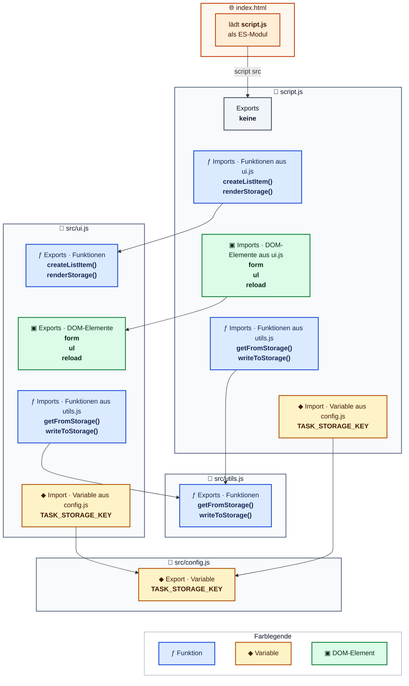

# Dateien, Imports und Exports

```mermaid
flowchart TB
  classDef function fill:#dbeafe,stroke:#1d4ed8,stroke-width:2px,color:#172554
  classDef variable fill:#fef3c7,stroke:#b45309,stroke-width:2px,color:#451a03
  classDef dom fill:#dcfce7,stroke:#15803d,stroke-width:2px,color:#052e16
  classDef neutral fill:#f1f5f9,stroke:#475569,stroke-width:2px,color:#0f172a
  classDef html fill:#ffedd5,stroke:#c2410c,stroke-width:2px,color:#431407

  subgraph HTML_FILE["🌐 index.html"]
    direction TB
    HTML_LOAD["lädt <b>script.js</b><br/>als ES-Modul"]:::html
  end

  subgraph SCRIPT_FILE["📄 script.js"]
    direction TB
    SCRIPT_MODULE["Exports<br/><b>keine</b>"]:::neutral
    SCRIPT_UI_FUNCTION_IMPORT["ƒ Imports · Funktionen aus ui.js<br/><b>createListItem()</b><br/><b>renderStorage()</b>"]:::function
    SCRIPT_UI_DOM_IMPORT["▣ Imports · DOM-Elemente aus ui.js<br/><b>form</b><br/><b>ul</b><br/><b>reload</b>"]:::dom
    SCRIPT_UTILS_IMPORT["ƒ Imports · Funktionen aus utils.js<br/><b>getFromStorage()</b><br/><b>writeToStorage()</b>"]:::function
    SCRIPT_KEY_IMPORT["◆ Import · Variable aus config.js<br/><b>TASK_STORAGE_KEY</b>"]:::variable

    SCRIPT_MODULE ~~~ SCRIPT_UI_FUNCTION_IMPORT
    SCRIPT_UI_FUNCTION_IMPORT ~~~ SCRIPT_UI_DOM_IMPORT
    SCRIPT_UI_DOM_IMPORT ~~~ SCRIPT_UTILS_IMPORT
    SCRIPT_UTILS_IMPORT ~~~ SCRIPT_KEY_IMPORT
  end

  subgraph UI_FILE["📄 src/ui.js"]
    direction TB
    UI_FUNCTION_EXPORT["ƒ Exports · Funktionen<br/><b>createListItem()</b><br/><b>renderStorage()</b>"]:::function
    UI_DOM_EXPORT["▣ Exports · DOM-Elemente<br/><b>form</b><br/><b>ul</b><br/><b>reload</b>"]:::dom
    UI_FUNCTION_IMPORT["ƒ Imports · Funktionen aus utils.js<br/><b>getFromStorage()</b><br/><b>writeToStorage()</b>"]:::function
    UI_KEY_IMPORT["◆ Import · Variable aus config.js<br/><b>TASK_STORAGE_KEY</b>"]:::variable

    UI_FUNCTION_EXPORT ~~~ UI_DOM_EXPORT
    UI_DOM_EXPORT ~~~ UI_FUNCTION_IMPORT
    UI_FUNCTION_IMPORT ~~~ UI_KEY_IMPORT
  end

  subgraph UTILS_FILE["📄 src/utils.js"]
    direction TB
    UTILS_FUNCTIONS["ƒ Exports · Funktionen<br/><b>getFromStorage()</b><br/><b>writeToStorage()</b>"]:::function
  end

  subgraph CONFIG_FILE["📄 src/config.js"]
    direction TB
    CONFIG_KEY["◆ Export · Variable<br/><b>TASK_STORAGE_KEY</b>"]:::variable
  end

  HTML_LOAD -->|"script src"| SCRIPT_MODULE

  SCRIPT_UI_FUNCTION_IMPORT --> UI_FUNCTION_EXPORT
  SCRIPT_UI_DOM_IMPORT --> UI_DOM_EXPORT

  SCRIPT_UTILS_IMPORT --> UTILS_FUNCTIONS
  UI_FUNCTION_IMPORT --> UTILS_FUNCTIONS

  SCRIPT_KEY_IMPORT --> CONFIG_KEY
  UI_KEY_IMPORT --> CONFIG_KEY

  UTILS_FUNCTIONS ~~~ CONFIG_KEY

  subgraph LEGEND["Farblegende"]
    direction LR
    LEGEND_FUNCTION["ƒ Funktion"]:::function
    LEGEND_VARIABLE["◆ Variable"]:::variable
    LEGEND_DOM["▣ DOM-Element"]:::dom
  end

  CONFIG_KEY ~~~ LEGEND_FUNCTION

  style CONFIG_FILE fill:#f8fafc,stroke:#64748b,stroke-width:2px,color:#0f172a
  style UTILS_FILE fill:#f8fafc,stroke:#64748b,stroke-width:2px,color:#0f172a
  style UI_FILE fill:#f8fafc,stroke:#64748b,stroke-width:2px,color:#0f172a
  style SCRIPT_FILE fill:#f8fafc,stroke:#64748b,stroke-width:2px,color:#0f172a
  style HTML_FILE fill:#fff7ed,stroke:#c2410c,stroke-width:2px,color:#431407
  style LEGEND fill:#ffffff,stroke:#94a3b8,stroke-width:1px,color:#0f172a
```

Die Pfeile zeigen jeweils von der importierenden zur exportierenden Datei.
