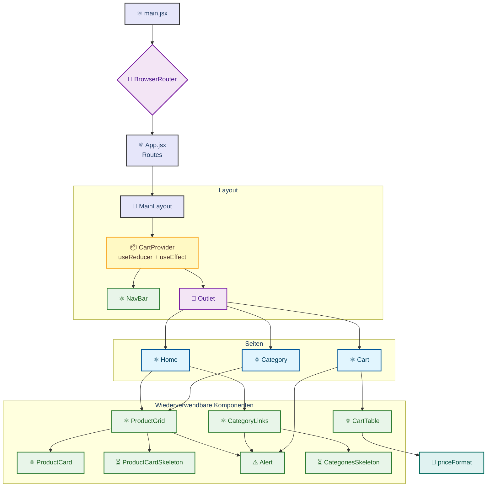
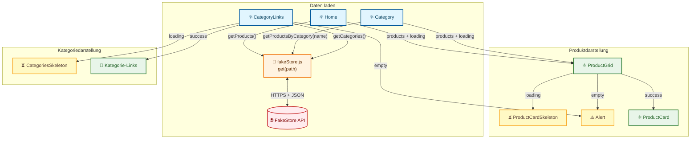
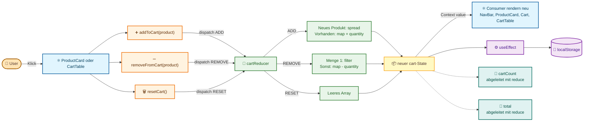
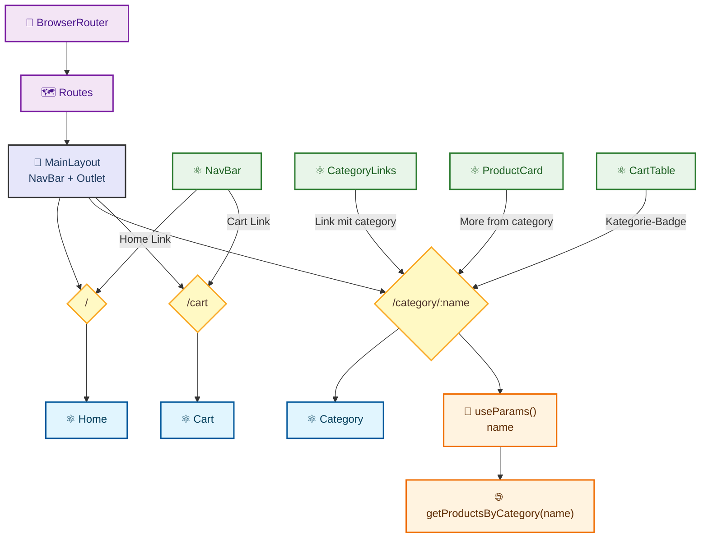

# Full Component Structure & Dependencies

```mermaid
graph TD
    Entry["⚛️ main.jsx"] --> Router{"🧭 BrowserRouter"}
    Router --> App["⚛️ App.jsx<br/>Routes"]
    App --> Layout["🧱 MainLayout"]

    subgraph LayoutLayer["Layout"]
        Layout --> Provider["📦 CartProvider<br/>useReducer + useEffect"]
        Provider --> Nav["⚛️ NavBar"]
        Provider --> Outlet["🧭 Outlet"]
    end

    subgraph Pages["Seiten"]
        Outlet --> Home["⚛️ Home"]
        Outlet --> Category["⚛️ Category"]
        Outlet --> Cart["⚛️ Cart"]
    end

    subgraph Components["Wiederverwendbare Komponenten"]
        Home --> CategoryLinks["⚛️ CategoryLinks"]
        Home --> ProductGrid["⚛️ ProductGrid"]
        Category --> ProductGrid
        ProductGrid --> ProductCard["⚛️ ProductCard"]
        ProductGrid --> ProductSkeleton["⏳ ProductCardSkeleton"]
        ProductGrid --> Alert["⚠️ Alert"]
        CategoryLinks --> CategorySkeleton["⏳ CategoriesSkeleton"]
        CategoryLinks --> Alert
        Cart --> CartTable["⚛️ CartTable"]
        Cart --> Alert
    end

    CartTable --> Price["🧮 priceFormat"]

    classDef root fill:#E6E6FA,stroke:#333,stroke-width:2px,color:#1E3A5F
    classDef router fill:#F3E5F5,stroke:#7B1FA2,stroke-width:2px,color:#4A148C
    classDef provider fill:#FFF9C4,stroke:#F9A825,stroke-width:2px,color:#4E342E
    classDef page fill:#E1F5FE,stroke:#01579B,stroke-width:2px,color:#003C5A
    classDef component fill:#E8F5E9,stroke:#2E7D32,stroke-width:2px,color:#1B5E20
    classDef utility fill:#E0F2F1,stroke:#00695C,stroke-width:2px,color:#004D40

    class Entry,App,Layout root
    class Router,Outlet router
    class Provider provider
    class Home,Category,Cart page
    class Nav,CategoryLinks,ProductGrid,ProductCard,ProductSkeleton,CategorySkeleton,Alert,CartTable component
    class Price utility
```

# Product Data & UI States

```mermaid
graph TB
    API[("🌐 FakeStore API")]

    subgraph DataSources["Daten laden"]
        Home["⚛️ Home"] -->|"getProducts()"| Client["🔌 fakeStore.js<br/>get(path)"]
        Category["⚛️ Category"] -->|"getProductsByCategory(name)"| Client
        CategoryLinks["⚛️ CategoryLinks"] -->|"getCategories()"| Client
        Client <-->|"HTTPS + JSON"| API
    end

    subgraph ProductStates["Produktdarstellung"]
        Home -->|"products + loading"| Grid["⚛️ ProductGrid"]
        Category -->|"products + loading"| Grid
        Grid -->|"loading"| ProductSkeleton["⏳ ProductCardSkeleton"]
        Grid -->|"empty"| Alert["⚠️ Alert"]
        Grid -->|"success"| ProductCard["⚛️ ProductCard"]
    end

    subgraph CategoryStates["Kategoriedarstellung"]
        CategoryLinks -->|"loading"| CategorySkeleton["⏳ CategoriesSkeleton"]
        CategoryLinks -->|"empty"| Alert
        CategoryLinks -->|"success"| Links["🧭 Kategorie-Links"]
    end

    classDef page fill:#E1F5FE,stroke:#01579B,stroke-width:2px,color:#003C5A
    classDef api fill:#FFEBEE,stroke:#C62828,stroke-width:2px,color:#7F0000
    classDef service fill:#FFF3E0,stroke:#EF6C00,stroke-width:2px,color:#5D2A00
    classDef component fill:#E8F5E9,stroke:#2E7D32,stroke-width:2px,color:#1B5E20
    classDef state fill:#FFF9C4,stroke:#F9A825,stroke-width:2px,color:#4E342E

    class Home,Category,CategoryLinks page
    class API api
    class Client service
    class Grid,ProductCard,Links component
    class ProductSkeleton,CategorySkeleton,Alert state
```

# Cart State Flow

```mermaid
flowchart LR
    User(["👤 User"])
    UI["⚛️ ProductCard oder CartTable"]

    User -->|"Klick"| UI
    UI --> Add["➕ addToCart(product)"]
    UI --> Remove["➖ removeFromCart(product)"]
    UI --> Reset["🗑️ resetCart()"]

    Add -->|"dispatch ADD"| Reducer["🔄 cartReducer"]
    Remove -->|"dispatch REMOVE"| Reducer
    Reset -->|"dispatch RESET"| Reducer

    Reducer -->|"ADD"| AddRule["Neues Produkt: spread<br/>Vorhanden: map + quantity"]
    Reducer -->|"REMOVE"| RemoveRule["Menge 1: filter<br/>Sonst: map - quantity"]
    Reducer -->|"RESET"| ResetRule["Leeres Array"]

    AddRule --> State["📦 neuer cart-State"]
    RemoveRule --> State
    ResetRule --> State

    State -->|"Context value"| Consumers["⚛️ Consumer rendern neu<br/>NavBar, ProductCard, Cart, CartTable"]
    State --> Effect["⚙️ useEffect"]
    Effect --> Storage[("💾 localStorage")]

    State -.-> Count["🧮 cartCount<br/>abgeleitet mit reduce"]
    State -.-> Total["🧮 total<br/>abgeleitet mit reduce"]

    classDef user fill:#FFE4B5,stroke:#A65E00,stroke-width:2px,color:#4E342E
    classDef component fill:#E1F5FE,stroke:#01579B,stroke-width:2px,color:#003C5A
    classDef action fill:#FFF3E0,stroke:#EF6C00,stroke-width:2px,color:#5D2A00
    classDef reducer fill:#E8F5E9,stroke:#2E7D32,stroke-width:2px,color:#1B5E20
    classDef state fill:#FFF9C4,stroke:#F9A825,stroke-width:2px,color:#4E342E
    classDef sideEffect fill:#F3E5F5,stroke:#7B1FA2,stroke-width:2px,color:#4A148C
    classDef derived fill:#E0F2F1,stroke:#00695C,stroke-width:2px,color:#004D40

    class User user
    class UI,Consumers component
    class Add,Remove,Reset action
    class Reducer,AddRule,RemoveRule,ResetRule reducer
    class State state
    class Effect,Storage sideEffect
    class Count,Total derived
```

# Navigation & Dynamic Routes

```mermaid
graph TB
    Router["🧭 BrowserRouter"] --> Routes["🗺️ Routes"]
    Routes --> Layout["🧱 MainLayout<br/>NavBar + Outlet"]

    Layout --> HomeRoute{"/"}
    Layout --> CategoryRoute{"/category/:name"}
    Layout --> CartRoute{"/cart"}

    HomeRoute --> Home["⚛️ Home"]
    CategoryRoute --> Category["⚛️ Category"]
    CartRoute --> Cart["⚛️ Cart"]

    Nav["⚛️ NavBar"] -->|"Home Link"| HomeRoute
    Nav -->|"Cart Link"| CartRoute
    CategoryLinks["⚛️ CategoryLinks"] -->|"Link mit category"| CategoryRoute
    ProductCard["⚛️ ProductCard"] -->|"More from category"| CategoryRoute
    CartTable["⚛️ CartTable"] -->|"Kategorie-Badge"| CategoryRoute

    CategoryRoute --> Params["🎣 useParams()<br/>name"]
    Params --> Request["🌐 getProductsByCategory(name)"]

    classDef router fill:#F3E5F5,stroke:#7B1FA2,stroke-width:2px,color:#4A148C
    classDef layout fill:#E6E6FA,stroke:#333,stroke-width:2px,color:#1E3A5F
    classDef route fill:#FFF9C4,stroke:#F9A825,stroke-width:2px,color:#4E342E
    classDef page fill:#E1F5FE,stroke:#01579B,stroke-width:2px,color:#003C5A
    classDef component fill:#E8F5E9,stroke:#2E7D32,stroke-width:2px,color:#1B5E20
    classDef hook fill:#FFF3E0,stroke:#EF6C00,stroke-width:2px,color:#5D2A00

    class Router,Routes router
    class Layout layout
    class HomeRoute,CategoryRoute,CartRoute route
    class Home,Category,Cart page
    class Nav,CategoryLinks,ProductCard,CartTable component
    class Params,Request hook
```
